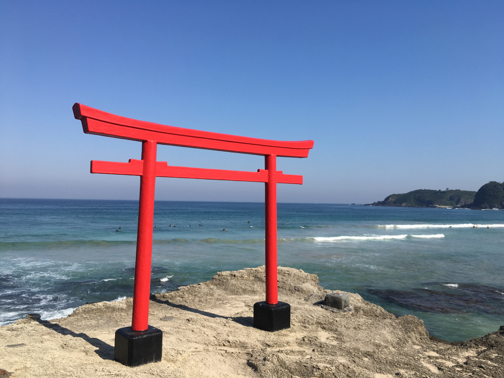

# hw01

## Edited by Xiufan Wu to include a brief biography

Hello, my name is **Xiufan Wu** and I am a second-year MA student in the *Committee on International Relations*. My research interests lies in the state-formation process of East Asian countries, and while I am mostly doing qualitative methods for my MA thesis, I am looking forward to introducing some quantitative elements to it. 

Here is a list of academic fields that I have some knowledge on

* International Security
* International Law
* International Political Economy
* Modern Japanese History
* Modern Chinese History
* Basic Statistical Methods for Political Science Research 
* Qualitative Research Methods
* Chinese Politics 

And here is the link to my poorly-managed [linkedin page](www.linkedin.com/in/wuxiufan)

It is a little bit embarrassing to share a picture of myself here, so I think I would share a picture that I took during my trip to Japan last year. As the pandemic has stopped us from international travel, hope this stunning view provide you with some comfort. 

