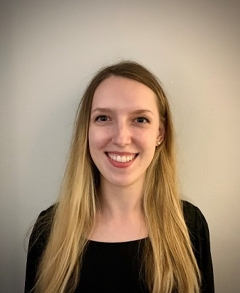

# hw01

# About Me
My name is **Anastasiya Apalkova** and I am a student in the MAPSS program concentrating in psychology. 
I was born in Ukraine and moved to Chicago with my family when I was seven years old. 
***
 
***
I did my undergrad at [UW-Madison](https://www.wisc.edu/) where I majored in psychology and sociology. 
During my MAPSS year I will be completing a _thesis_ in social psychology as well as working on improving my 
_computational and quantitative skills_ to prepare for PhD study. 
During my free time I enjoy:

* Reading 
  + mostly non-fiction
* Listening to podcasts 
  + anything NPR
  + true crime
* And going on walks