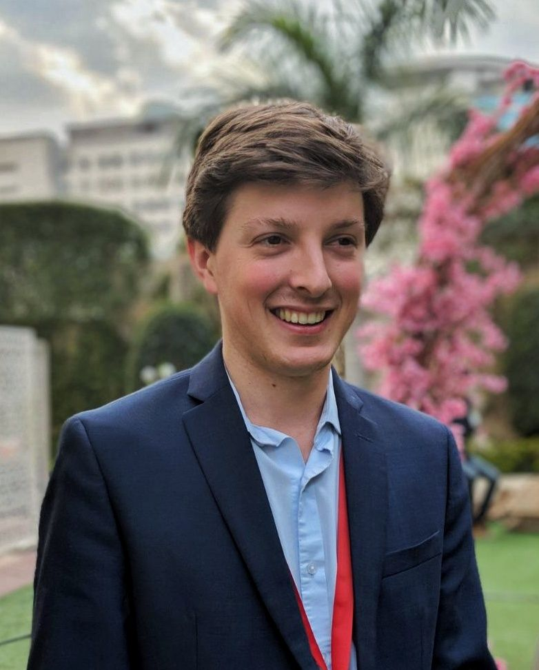

# Computing for the Social Sciences
## The First Homework

#### Who Am I? (... I am Jean Valjean!??)

{width=50%}

I'm Jesse Orr, a second year student at Harris from **Baltimore, MD**.  Well, technically **Owings Mills, MD**, a suburb of Baltimore.

After finishing high school in Maryland, I first came to Chicago in 2011 when I began my UChicago career as an undergrad, where I lived in *Crown House* in South Campus.

I knew that I wanted to learn a foreign language, and I already had taken Spanish all through school (plus, spoke it as a heritage speaker) so I began to take **Hindi**.  This would lead to all sorts of interesting life outcomes, and would keep me in the UChicago orbit...

As an undergrad, I was engaged in a variety of different activities, namely:

1. ChoMUN
2. Team
3. MUNUC
4. ...
5. ...
6. ...
7. I wrote one or two *Maroon* articles?

Just kidding. No variety.  I really only did Model UN.

After graduating, I ~~dicked around~~ *interned* in DC for a year in "Business Development and New Initiatives" for a think tank.

Then I began a Fellowship with the **International Innovation Corps** in India, working with state and local governments to build capacity in various sectors.

I spent my first year working with the Ministry of Municipal Administration and Urban Development of Andhra Pradesh as part of a special group called the "Swachh Andhra Corporation" on a Septage Management project.

I.e... what happens when someone's septic tank fills up (sewage systems with full urban coverage are capital intensive and time consuming to build and operate, especially in already-existing cities; as a result, there are very few in India outside of top-tier cities).

It was actually a great time.