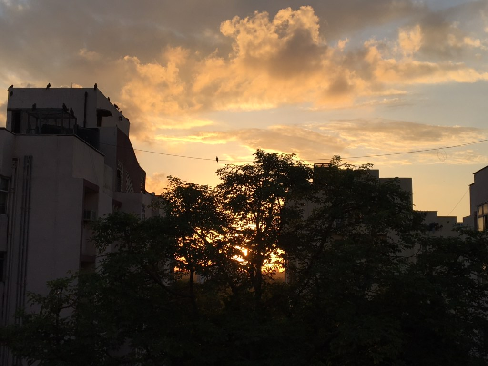

# hw01

## Ishita Singhal's attempt at a short biography

Hi everyone, I'm Ishita - a MAPSS student in the psychology concentration. I'll be studying remotely this quarter from my hometown in India. 

Here is what the view outside my window looks like right now - 

####Here are three things about me
* I love reading. This past summer, I've rediscovered my love for fiction.
  * I recently read *Anxious People* by Fredrik Backman, and it's the best book I've read this year. I highly recommend it. 

* I really enjoy travelling, so I'm very excited to explore Chicago next year!

* Although I find myself fascinated by practically the entirety of psychological research, particularly social psychology, my two main areas of research interest are - 
  * Prosocial Behaviour and intergroup helping
  * Meaning and well-being

* BONUS FACT - I love Avatar: The Last Airbender. 

 
