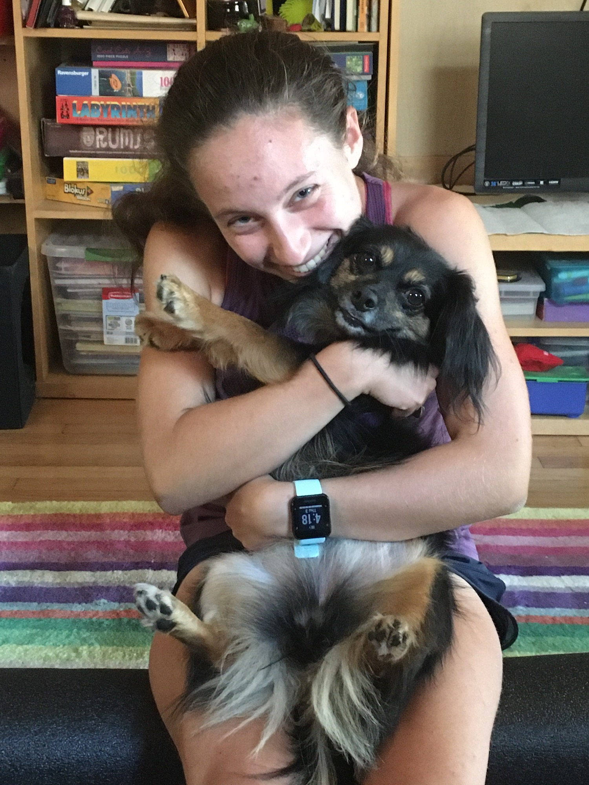

# Biography of Anna Kenig-Ziesler 

{width=50%}

My name is Anna Kenig-Ziesler, and I am a third year in the College. I am majoring in Public Policy and minoring in Human Rights. I am really interested in better understanding how data can be used to inform public policy, so I am really excited to be taking this course! On campus, I am very involved in UChiVotes, and I am really passionate about getting out the vote this election. While I am unsure of what I want to do career-wise, I would love to work on environmental or civil rights issues in some capacity.

Outside of class, a few of my favorite things are listed in italics below: 

_* Soccer_
_* Running_
_* Biking_
_* Cats (but I love dogs too)_
_* Healthy (vegan) food_
_* Dark chocolate_
_* Outdoors_

I am a member of the Women's Soccer team, and I also love to run. I am a little bit of a fitness freak, and I pretty much love any form of working out. I spend pretty much all of the (limited) free time that I have doing something active! One of my favorite things to do in Chicago is to run downtown with friends to get donuts.  

I also really love pets, and I have two cats and a dog at home. While I have always been a cat person, dogs have definitely grown on me since we got our dog a few years ago! 

