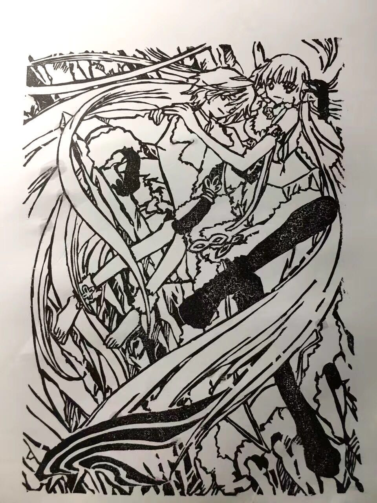

# hw01

# Self Introduction

### Background

My name is **Yucheng Lu**, and I am originally from Shanghai, China.  I just finished my undergraduate degree in *Wake Forest University* with a major in Psychology and a minor in Japanese.  I thought the mascot of our school is funny, so here is a link to his picture.

[Image of WFU Mascot](https://images.app.goo.gl/xLRC5L9ToWQDz3qt9)

### Hobby

During spare time, I like to

* Keep succulent plants
* Watch Japanese animation
* Carve erasers into stamps

Here is a picture of one of the eraser stamps I carved.

I am currently still living in China due to the pandemic, so I am eager to meet everyone in person. Hope to see you soon when everything goes back to normal!